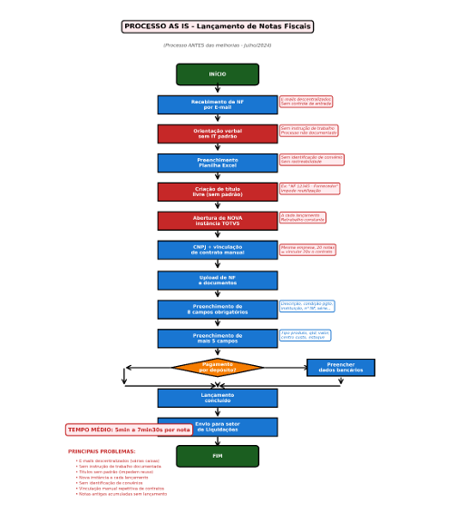
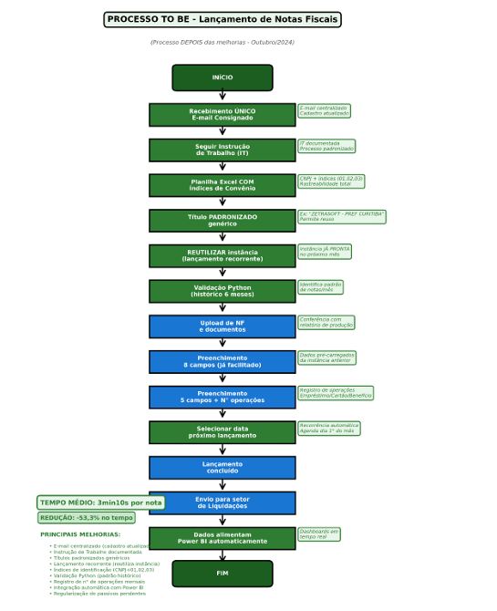
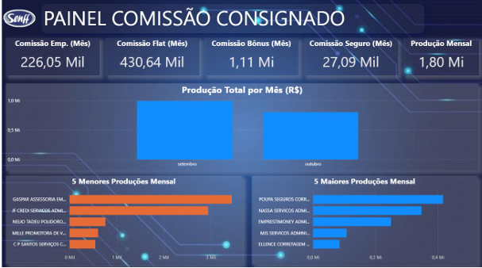
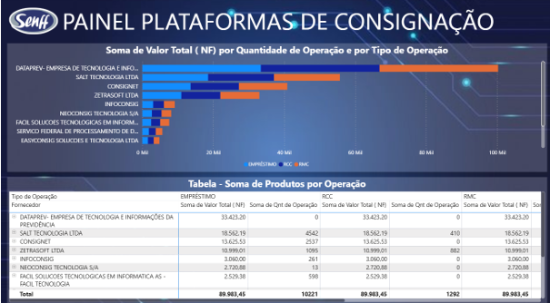

# 📋 Eficiência Operacional e Melhoria Contínua
### Estudo de Caso sobre o Processo de Lançamento de Notas Fiscais no Setor de Crédito Consignado

> Trabalho de Conclusão de Curso apresentado ao curso de **Bacharelado em Administração** — UNINTER

---

## 🎯 Sobre o projeto

Este trabalho investigou o processo de lançamento de notas fiscais no setor de crédito consignado, identificando gargalos operacionais e propondo melhorias com base em mapeamento de processos, automação e Business Intelligence.

O resultado foi uma **redução de 53% no tempo de processamento** de faturas consignadas — de 7min30s para 3min30s por nota fiscal.

---

## 📌 Objetivos

- Mapear o processo atual (**AS IS**), identificando gargalos e oportunidades de melhoria
- Aplicar práticas de padronização e **melhoria contínua (TO BE)**
- Desenvolver um **dashboard no Power BI** com indicadores de eficiência operacional, gestão de custos e performance de fornecedores
- Avaliar os resultados obtidos após a implementação das melhorias

---

## 📊 Resultados alcançados

| Indicador | Antes | Depois | Melhoria |
|-----------|-------|--------|----------|
| Tempo médio por nota fiscal | 7min 30s | 3min 30s | **↓ 53%** |
| Padronização do processo | Inexistente | Instrução de trabalho documentada | ✅ |
| Monitoramento de indicadores | Manual | Dashboard Power BI | ✅ |
| Automação de validações | Nenhuma | Scripts Python | ✅ |

---

## 🗺️ Mapeamento de Processos

### Processo Atual — AS IS

### Processo Proposto — TO BE

---

## 📈 Dashboard Power BI

O painel desenvolvido consolida os principais indicadores de desempenho operacional, permitindo monitoramento contínuo e apoio à gestão estratégica.

**Painel de Comissão**

> 🔗 [Acesse o dashboard interativo aqui](https://app.powerbi.com/view?r=eyJrIjoiOTQ0MmEzOTgtMWZjZS00MGE2LTg0YjEtYjhiODBmMDFmMWRkIiwidCI6ImY2MzBmYjUyLWE1ZGEtNDA3NS05NzY4LWIyNzBhMDkxMjM1ZSJ9)

**Plataforma de Consignação**

> 🔗 [Acesse o dashboard interativo aqui](https://app.powerbi.com/view?r=eyJrIjoiOTQ0MmEzOTgtMWZjZS00MGE2LTg0YjEtYjhiODBmMDFmMWRkIiwidCI6ImY2MzBmYjUyLWE1ZGEtNDA3NS05NzY4LWIyNzBhMDkxMjM1ZSJ9)

---

## 🛠️ Tecnologias utilizadas

---

## 📄 Documento completo

O TCC completo está disponível em: [📥 TCC_Daiane_Santos.pdf](TCC_Daiane_Santos.pdf)

---

## 👩‍💻 Autora

**Daiane Santos**
Analista de Produtos Financeiros | Dados & Processos

